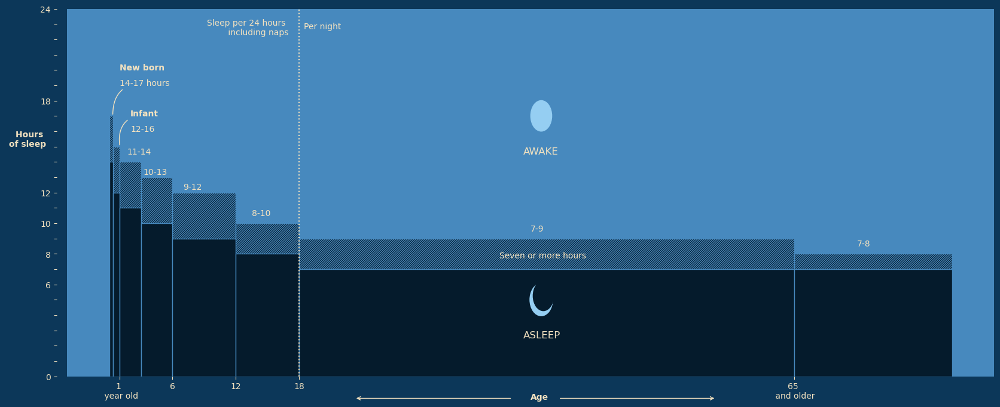
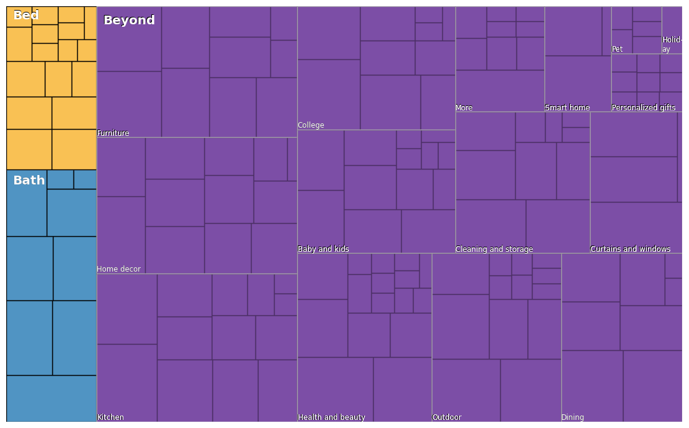
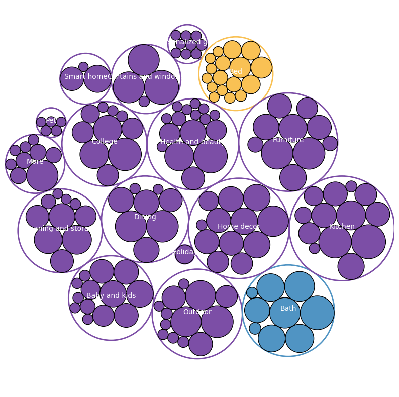
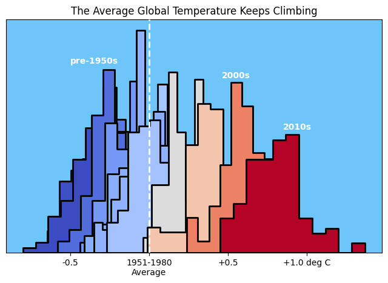
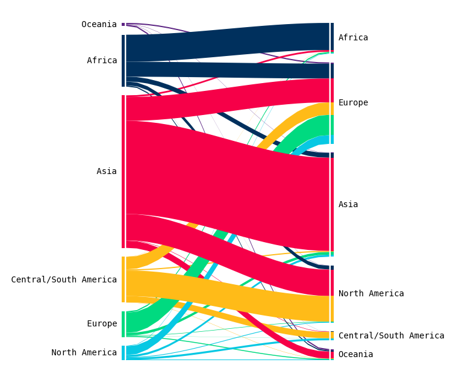
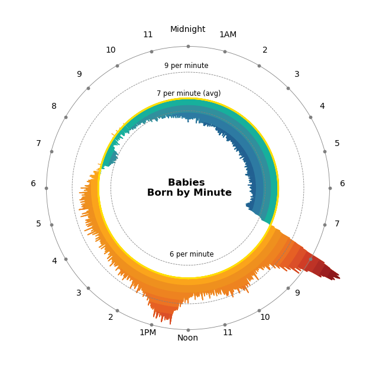
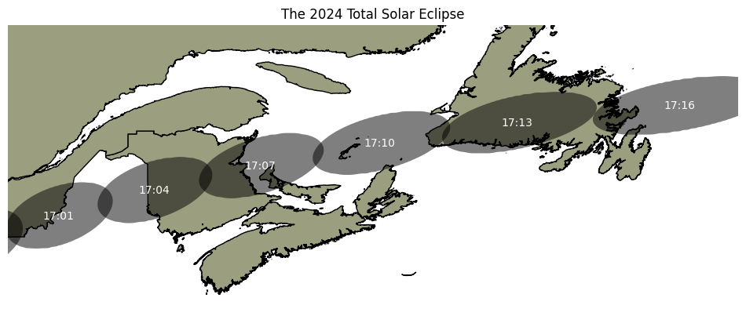

# Data Visualization in Python

> All the data visualization files are in the Assignments folders along with their instructions PDF.

## Some of my favorite Visualizations

### Foray NL Data Science Contest Poster

### Customer Support Efficiency Poster 

### Sleep Cycle Visualization using Merimekko Chart

### Bed, Bath & Beyond Products category chart (Rectangular)

### Bed, Bath & Beyond Products category chart (Bubbles)

### Average Global Temperature

### Immigration Map using Alluvial Diagram

### Baby Born Hours (Radial Diagram)

### Best Selling Gaming Consoles

### Total Solar Eclipse Mapping

#### Total Solar Eclipse Mapping using JS Leaflet Library

